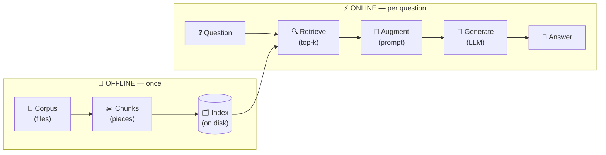

<div align="center">

# 🧠 00 — What is RAG?

**Retrieval-Augmented Generation, explained from zero**

`📚 Concepts` · `⏱️ ~15 min read` · `🎯 No prior knowledge needed`

</div>

---

> [!IMPORTANT]
> **TL;DR** — A language model only knows what it saw during training. **RAG** lets it answer questions about things it has never seen:
> 1. 🔍 **search** a collection of documents for the relevant passages,
> 2. 📎 hand those passages to the model,
> 3. ✍️ ask it to answer **from them**, not from memory.

---

## 📑 Contents

1. [🧊 The problem: a model frozen in time](#-1-the-problem-a-model-frozen-in-time)
2. [🛠️ Three ways to give a model new knowledge](#️-2-three-ways-to-give-a-model-new-knowledge)
3. [📖 The analogy: an open-book exam](#-3-the-analogy-an-open-book-exam)
4. [⚙️ The four stages](#️-4-the-four-stages)
5. [✏️ A worked example, by hand](#️-5-a-worked-example-by-hand)
6. [📏 Two kinds of quality](#-6-two-kinds-of-quality)
7. [🔤 Lexical vs semantic search](#-7-lexical-vs-semantic-search)
8. [🗺️ How this maps to the project](#️-8-how-this-maps-to-the-project)
9. [🚫 Common misconceptions](#-9-common-misconceptions)
10. [✅ Check your understanding](#-10-check-your-understanding)

---

## 🧊 1. The problem: a model frozen in time

A language model like **Qwen3-0.6B** learns by reading a huge amount of text **once**, during training. When training ends, its knowledge is **frozen** ❄️. Everything it "knows" is stored implicitly in its weights.

That causes three problems:

| | Problem | Example |
|:-:|---|---|
| 📅 | **Outdated knowledge** | The model was trained before a library's latest release, so it doesn't know about new flags or functions. |
| 🔒 | **Private or niche data** | Your company's codebase or internal docs were never public, so the model never saw them. |
| 🎭 | **Hallucination** | When the model doesn't know, it rarely says so. It produces the most *plausible-sounding* text, which can be completely wrong. |

> [!WARNING]
> The third problem is the dangerous one. Ask a small model:
>
> 💬 *"What is the default value of `--max-num-seqs` in vLLM 0.10.1?"*
>
> It will probably answer with a **confident number**. It may even be right by luck, but it has **no way to check**. It is predicting text that *looks like* an answer, not looking anything up.

---

## 🛠️ 2. Three ways to give a model new knowledge

| Approach | Idea | Verdict |
|---|---|:-:|
| 🏋️ **Retrain / fine-tune** | Train the model further on the new data | ❌ Slow, expensive, needs GPUs, and must be redone every time the data changes. It still doesn't guarantee exact recall of facts. |
| 📦 **Paste everything into the prompt** | Put the whole corpus in the model's input | ❌ A model can only read a limited amount of text at once (its **context window**). The vLLM repo has thousands of files, far too large. Even if it fit, a small model would drown in noise. |
| 🔍 **Retrieve, then generate (RAG)** | Search for the few relevant passages and give only those to the model | ✅ Fast, cheap, works with a small model, and updating knowledge only means re-indexing documents. |

> [!TIP]
> 💡 RAG doesn't make the model smarter. It changes **what the model is looking at** when it answers.

---

## 📖 3. The analogy: an open-book exam

Imagine two students taking an exam about a **2,000-page** technical manual.

<table>
<tr>
<th width="50%">🧑‍🎓 Student A — plain LLM</th>
<th width="50%">👩‍🎓 Student B — RAG system</th>
</tr>
<tr>
<td>

Studied the manual **months ago** and must answer **from memory**.

When unsure… they **guess** and write something convincing. 🎲

</td>
<td>

Can bring the manual 📘, but only has time to read **a few pages** per question.

Their success depends on **finding the right pages**. 🎯

</td>
</tr>
</table>

Student B needs two **separate** skills:

| Skill | RAG name |
|---|---|
| 🔎 Finding the right pages quickly | **Retrieval** |
| ✍️ Reading them and writing a correct answer | **Generation** |

> [!NOTE]
> If Student B opens the **wrong pages**, it doesn't matter how good a writer they are: the answer will be wrong or made up. That's why, in this project, **retrieval quality is what gets measured first**.

---

## ⚙️ 4. The four stages

The first stage happens **once, ahead of time** (🌙 offline). The other three happen **every time a question is asked** (⚡ online).



<details>
<summary>📟 Plain-text version of the diagram</summary>

```
     OFFLINE (once)                     ONLINE (per question)
 Corpus ─► Chunks ─► Index ──►  Question ─► Retrieve ─► Augment ─► Generate ─► Answer
 (files)  (pieces)  (disk)                  (top-k)     (prompt)    (LLM)
```

</details>

---

### 1️⃣ Indexing — 🌙 *offline*

> 🎯 **Goal:** organise the documents so they can be searched **fast**.

| | |
|---|---|
| 📥 **Input** | Raw files (the vLLM repository: Python code, Markdown docs…) |
| ⚙️ **What happens** | **1.** Read the useful files. **2.** Split each one into smaller pieces called **chunks** (doc 02). **3.** Turn each chunk into something searchable (docs 03–06). **4.** Save the result to disk: the **index**. |
| 📤 **Output** | An index on disk |
| 📘 **Analogy** | Writing the index at the back of a book: slow once, then every lookup is instant. |

> [!TIP]
> Why chunks? A whole file is **too big** to hand to the model, and **too vague** to be a precise search result.

---

### 2️⃣ Retrieving — ⚡ *online*

> 🎯 **Goal:** given a question, find the most relevant chunks.

| | |
|---|---|
| 📥 **Input** | A question + the index |
| ⚙️ **What happens** | Every chunk gets a **relevance score**, and the best *k* are kept: the **top-k** 🏆 |
| 📤 **Output** | A ranked list of sources. Each one is a **location**: file path + character range (doc 01) |
| 📘 **Analogy** | Looking up the book's index and noting which pages to read |

---

### 3️⃣ Augmenting — ⚡ *online*

> 🎯 **Goal:** build the input the model will actually read.

| | |
|---|---|
| 📥 **Input** | The question + the retrieved chunks |
| ⚙️ **What happens** | Chunk texts + question + instructions are combined into a single **prompt** (e.g. *"Answer using only the context below…"*). The context window is limited, so you may have to choose what goes in. |
| 📤 **Output** | A prompt |
| 📘 **Analogy** | Photocopying the relevant pages and stapling them to the exam question 📎 |

---

### 4️⃣ Generating — ⚡ *online*

> 🎯 **Goal:** produce a natural-language answer.

| | |
|---|---|
| 📥 **Input** | The prompt |
| ⚙️ **What happens** | The LLM reads the prompt and writes an answer. The facts are right there, so it can **copy and rephrase** instead of guessing. |
| 📤 **Output** | The answer text 💬 |
| 📘 **Analogy** | Writing the answer with the photocopies in front of you |

> [!NOTE]
> 🏷️ **"Augmented"** in the name refers to stage 3: the model's input is *augmented* with retrieved information.

---

## ✏️ 5. A worked example, by hand

Let's run the whole pipeline on a tiny made-up corpus of **three files**.

<table>
<tr>
<th>📄 <code>docs/install.md</code></th>
<th>📄 <code>docs/server.md</code></th>
<th>🐍 <code>vllm/config.py</code></th>
</tr>
<tr>
<td>

```markdown
# Installation
Install vLLM with pip.
A GPU with CUDA is
recommended.
```

</td>
<td>

```markdown
# OpenAI server
Start the server with
`vllm serve <model>`.
The default port is 8000.
Use --port to change it.
```

</td>
<td>

```python
class ServerConfig:
    port: int = 8000
    host: str = "localhost"
```

</td>
</tr>
</table>

### 1️⃣ Indexing

The files are tiny, so each one is a single chunk. For each chunk we record **where it lives** and **which words it contains**:

| Chunk | 📍 Location | 🔤 Some of its words |
|:-:|---|---|
| 🅰️ | `docs/install.md`, chars 0 → 70 | installation, install, vllm, pip, gpu, cuda |
| 🅱️ | `docs/server.md`, chars 0 → 106 | openai, server, start, vllm, serve, default, **port**, 8000 |
| ©️ | `vllm/config.py`, chars 0 → 70 | class, serverconfig, **port**, int, 8000, host |

<sub>*Character ranges are approximate here. Doc 01 explains them precisely.*</sub>

### 2️⃣ Retrieving

> ❓ **Question:** *"What port does the vLLM server use by default?"*

A very naive idea: count how many question words appear in each chunk.

| Chunk | Matching words | Score | |
|:-:|---|:-:|:-:|
| 🅰️ | vllm | 1 | ⬜ |
| 🅱️ | port, vllm, server, default | **4** | 🥇 |
| ©️ | port | 1 | ⬜ |

With *k* = 2, we keep **🅱️** plus one of 🅰️ / ©️ (tied).

> [!CAUTION]
> ⚠️ Counting words is **far too simple** for a real system: it ignores how **rare** a word is, how **long** the chunk is, and more. Docs 04 (TF-IDF) and 05 (BM25) show how to do better. But the **idea** stays the same: score every chunk, keep the best *k*.

### 3️⃣ Augmenting

```text
Answer the question using only the context below.

[Source: docs/server.md]
Start the server with `vllm serve <model>`. The default port is 8000.
Use --port to change it.

[Source: vllm/config.py]
class ServerConfig:
    port: int = 8000
    ...

Question: What port does the vLLM server use by default?
```

### 4️⃣ Generating

> 🤖 *The vLLM server uses port **8000** by default. You can change it with the `--port` option.*

✅ Every fact in that answer appears in the context. The answer is **grounded**.

### 💥 What if retrieval had failed?

Suppose stage 2 had returned **only chunk 🅰️** (the installation page). The prompt contains **nothing about ports**. The model then either:

- 🙋 says it doesn't know (the good outcome), or
- 🎭 **invents** a port number (a hallucination).

> [!IMPORTANT]
> The model was the **same** in both cases. Only retrieval changed. **Bad retrieval caps the quality of everything after it.** 📉

---

## 📏 6. Two kinds of quality

A RAG system can fail in two **independent** ways:

| | 🔍 Retrieval quality | ✍️ Generation quality |
|---|---|---|
| **Question** | Did we find the right passages? | Did the model use them correctly? |
| **Measured by** | **recall@k** vs reference sources, automatically, by the moulinette 🤖 (doc 07) | Human judgement 👀: coherent, grounded, on point |
| **Typical failure** | The right chunk exists but ranks 12th, so it never reaches the model | The right chunk was retrieved, but the model ignored it or mixed in invented facts |

> [!IMPORTANT]
> 🎯 This project **grades retrieval primarily**, with hard thresholds:
>
> | Dataset | Required |
> |---|:-:|
> | 📝 Docs questions | **≥ 80 %** recall@5 |
> | 💻 Code questions | **≥ 50 %** recall@5 |
>
> Answers are judged more loosely, because Qwen3-0.6B is a small model with limited reasoning.

---

## 🔤 7. Lexical vs semantic search

| | 🔤 Lexical search | 🧭 Semantic search |
|---|---|---|
| **Matches** | **Words** | **Meaning** |
| **How** | A chunk scores well if it contains the question's words, especially rare ones | Text becomes vectors (embeddings), so similar ideas end up close together |
| **Examples** | TF-IDF, BM25 | Sentence embeddings (e.g. `all-MiniLM-L6-v2`) |
| **✅ Strong at** | Exact identifiers like `max_num_seqs`, fast, explainable | Paraphrases ("launch" ≈ "start") |
| **❌ Weak at** | Paraphrases | Exact names, slower |
| **In this project** | 🟢 **Mandatory** (TF-IDF or BM25) | 🎁 Bonus (doc 11) |

---

## 🗺️ 8. How this maps to the project

### 🖥️ Stages → CLI commands

| Stage | Command | 📥 Reads | 📤 Writes |
|---|---|---|---|
| 1️⃣ Indexing | `index` | `data/raw/` | `data/processed/` |
| 2️⃣ Retrieving | `search` (one) / `search_dataset` (many) | index + questions | `StudentSearchResults` JSON |
| 3️⃣ + 4️⃣ Augment & Generate | `answer` (one) / `answer_dataset` (many) | search results + chunk texts | `StudentSearchResultsAndAnswer` JSON |
| 📊 Evaluating | `evaluate` (yours) / moulinette (official) | your results + ground truth | recall@k scores |

### 📋 Subject constraints per stage

| Stage | Constraint |
|---|---|
| 1️⃣ Indexing | ⏱️ Whole corpus in **≤ 5 min** · ✂️ **Two chunking strategies** (Python code + Markdown/text) · 📏 Chunks **≤ `--max_chunk_size`** (default 2000 chars) |
| 2️⃣ Retrieving | 🔤 **TF-IDF or BM25** · ⏱️ **200 questions in ≤ 90 s** · 📏 Each source **≤ 2000 chars** · 📍 `file_path` written **exactly** as in the corpus |
| 4️⃣ Generating | 🤖 Must work with **Qwen/Qwen3-0.6B** · 🧾 Output follows the pydantic models |
| 🌐 Everywhere | 🛡️ Never crash on odd input: empty query, `k=0`, missing files, malformed JSON |

### 🧩 Why separate commands?

Each stage writes its result to disk, so:

- 🔁 you can **re-run one stage** without redoing the others;
- 🔬 you can **inspect** intermediate results (open the search JSON and see what was retrieved);
- 🤖 the moulinette can grade retrieval **on its own**, before any answer is generated.

---

## 🚫 9. Common misconceptions

| ❌ Myth | ✅ Reality |
|---|---|
| "RAG trains the model on my documents." | The model's weights **never change**. Only its **input** changes. |
| "A better LLM will fix bad results." | Not if retrieval is bad. A brilliant model given the wrong pages still can't answer. |
| "Retrieve as many chunks as possible, to be safe." | More chunks means more noise and a fuller context window. Small models get confused. There's a **balance**. ⚖️ |
| "The model will say 'I don't know' when the context is missing." | Not reliably. Prompts usually instruct it **explicitly** to answer only from the context. |
| "Search results are just text." | Here, a result is a **location** 📍 (path + character range). The text is read *from* that location. |

---

## ✅ 10. Check your understanding

Try to answer before opening the hints. 🧩

**1.** Why can't we simply put the whole vLLM repository in the prompt? Give two reasons.
<details><summary>💡 Hint</summary>Think about the model's input limit… and about what a small model does with lots of irrelevant text. (Section 2)</details>

**2.** Which stage runs once, and which run for every question? Why does that split matter for performance?
<details><summary>💡 Hint</summary>Look at the 🌙 / ⚡ labels in the diagram. What would happen if indexing ran for each of 200 questions? (Section 4)</details>

**3.** In the worked example, what would happen to the final answer if stage 2 returned only chunk 🅰️? Which metric would reveal the problem?
<details><summary>💡 Hint</summary>Is the answer anywhere in chunk 🅰️? Which of the two kinds of quality failed? (Sections 5 and 6)</details>

**4.** A question asks about `gpu_memory_utilization`. Would lexical or semantic search be more likely to find the right chunk? And for *"how do I reduce VRAM usage?"*
<details><summary>💡 Hint</summary>One question contains an exact identifier; the other paraphrases an idea. (Section 7)</details>

**5.** The model gave a fluent, confident answer, but recall@5 for that question was 0. What does that suggest about the answer?
<details><summary>💡 Hint</summary>Where could the facts in the answer have come from, if not from the retrieved sources? (Sections 1 and 5)</details>

**6.** Why does the project grade retrieval with a strict number, but answers only loosely?
<details><summary>💡 Hint</summary>Which one can be checked automatically? And what does the subject say about Qwen3-0.6B? (Section 6)</details>

---

## 📚 Further reading

- 📄 Lewis et al., *Retrieval-Augmented Generation for Knowledge-Intensive NLP Tasks* (2020), the paper that named RAG: <https://arxiv.org/abs/2005.11401>
- 📘 Manning, Raghavan & Schütze, *Introduction to Information Retrieval*, a free book and the classic reference for indexing, TF-IDF and evaluation: <https://nlp.stanford.edu/IR-book/>

---

<div align="center">

[🏠 Docs index](README.md) · **Next →** [01 — The corpus and character offsets 📍](01-corpus-and-offsets.md)

</div>
